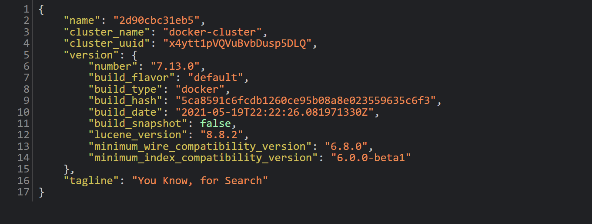
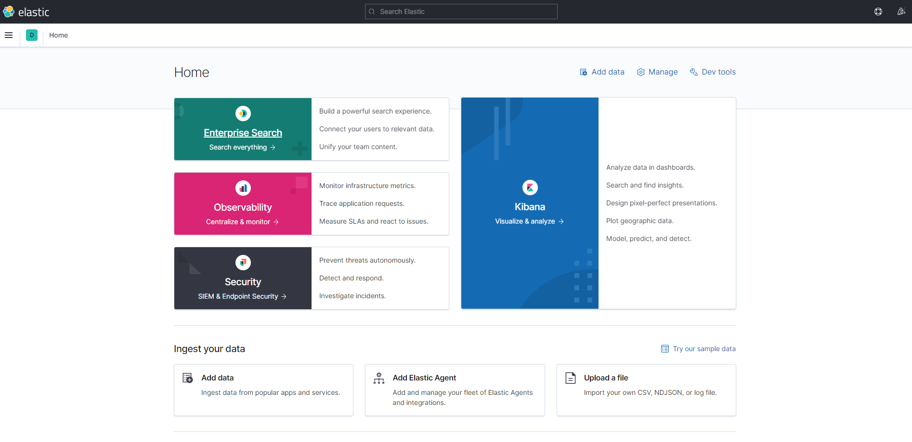

# ELASTICSEARCH & KIBANA NOTES

---
## A. Requirements

1. Make sure you have cloned this [repository](https://github.com/ardhiraka/DEBlitz).

2. Make sure that the Docker and PostgreSQL applications are installed on your computer

3. **It is highly recommended to use Python 3.9 or Python 3.10.** If you have Python 3.11, create another Python environment with Python 3.9 or Python 3.10 (Python 3.9 is recommended). Example of how to create a new Python's environment with Anaconda.

   *The syntax below will create a new environment named `env_py39`. You can change the name of this environment according to your preference.*
   ```sh
   conda create -n env_py39 python=3.9
   ```

4. **Use the same Python environment to run Apache Airflow, Elasticsearch, and Kibana**.

5. Install the following packages : 
   ```py
   pip install "elasticsearch<7.14"
   pip install faker
   pip install --upgrade "numpy<2.0"
   pip install --upgrade "pandas<2.0.0"
   ```

6. Make sure the above packages are installed succesfully before you run docker-compose of Elasticsearch and Airflow.

---
## B. Setup

1. Open Docker Desktop.

2. Open file `DEBlitz/compose_file/elastic-kibana.yml`.

3. Change the following lines :
   * **For Non Apple M1/M2/M3 Computer**
     * Elasticsearch version
   
        **BEFORE**
         ```yml
         version: "3.3"
         services:
            elasticsearch:
               image: docker.elastic.co/elasticsearch/elasticsearch:7.4.0
               container_name: elasticsearch
         ```

         **AFTER**
         ```yml
         version: "3.3"
         services:
            elasticsearch:
               image: docker.elastic.co/elasticsearch/elasticsearch:7.13.0
               container_name: elasticsearch
         ```
      
      * Kibana version
   
        **BEFORE**
         ```yml
         kibana:
            container_name: kibana
            image: docker.elastic.co/kibana/kibana:7.4.0
         ```
   
         **AFTER**
         ```yml
         kibana:
            container_name: kibana
            image: docker.elastic.co/kibana/kibana:7.13.0
         ```
   * **For Apple M1/M2/M3 Computer**
     * Elasticsearch version
   
        **BEFORE**
         ```yml
         version: "3.3"
         services:
            elasticsearch:
               image: docker.elastic.co/elasticsearch/elasticsearch:7.4.0
               container_name: elasticsearch
         ```

         **AFTER**
         ```yml
         version: "3.3"
         services:
            elasticsearch:
               image: docker.elastic.co/elasticsearch/elasticsearch:7.13.0-arm64
               container_name: elasticsearch
         ```
      
      * Kibana version
   
        **BEFORE**
         ```yml
         kibana:
            container_name: kibana
            image: docker.elastic.co/kibana/kibana:7.4.0
         ```
   
         **AFTER**
         ```yml
         kibana:
            container_name: kibana
            image: docker.elastic.co/kibana/kibana:7.13.0-arm64
         ```
4. Open Command Prompt or Terminal.

5. Change directory to `DEBlitz/compose_file/`.

6. Run file `elastic-kibana.yml` with command :  
   ```py
   docker-compose -f elastic-kibana.yml up
   ```
   Let this command prompt run and open to use Kibana & Elastic.

7. Check apps :
   - Open your browser
   - For **Elasticsearch**, type `http://localhost:9200` in your browser tab
     
   - For **Kibana**, type `http://localhost:5601` in your browser tab
     

8. To close the apps :
   - Open Command Prompt or Terminal and change directory to `DEBlitz/compose_file/`.
   - Run the following command in Command Prompt or Terminal
     ```py
     docker-compose -f elastic-kibana.yml down
     ```
