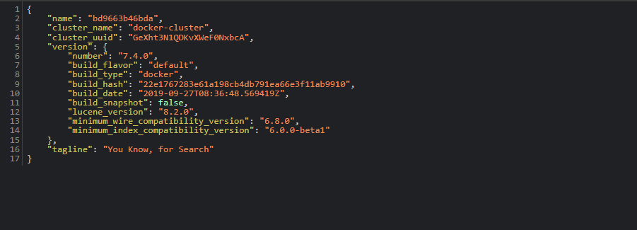
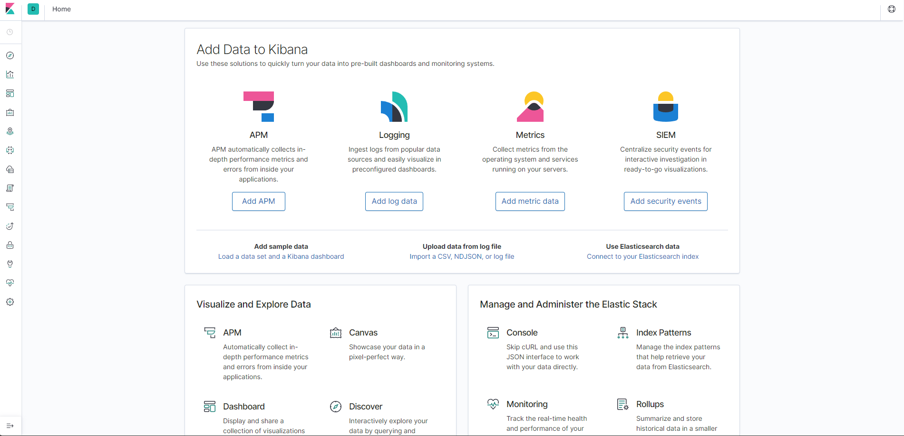

# ELASTICSEARCH & KIBANA NOTES

---
## A. Requirements

1. Make sure you have cloned this [repository](https://github.com/ardhiraka/DEBlitz).

2. Make sure that the Docker and PostgreSQL applications are installed on your computer

3. **It is highly recommended to use Python 3.9 or Python 3.10.** If you have Python 3.11, create another Python environment with Python 3.9 or Python 3.10 (Python 3.9 is recommended).

4. Install the following packages : 
   ```py
   pip install "elasticsearch<7.14"
   pip install faker
   ```

5. Make sure the above packages are installed succesfully before you run docker-compose of Elasticsearch and Airflow.

---
## B. Setup

### B.1 For Non Apple M1/M2 Computer
1. Open Command Prompt or Terminal.

2. Change directory to `DEBlitz/compose_file/`.

3. Run file `elastic-kibana.yml` with command :  
   ```py
   docker-compose -f elastic-kibana.yml up
   ```
   Let this command prompt run and open to use Kibana & Elastic.

4. Check apps :
   - Open your browser
   - For **Elasticsearch**, type `http://localhost:9200` in your browser tab
     
   - For **Kibana**, type `http://localhost:5601` in your browser tab
     

5. To close the apps :
   - Open Command Prompt or Terminal and change directory to `DEBlitz/compose_file/`.
   - Run the following command in Command Prompt or Terminal
     ```py
     docker-compose -f elastic-kibana.yml down
     ```

### B.2 For Apple M1/M2 Computer
1. Open file `DEBlitz/compose_file/elastic-kibana.yml`.

2. Change the following lines : 
   * Elasticsearch version

     **BEFORE**
      ```yml
      version: "3.3"
      services:
         elasticsearch:
            image: docker.elastic.co/elasticsearch/elasticsearch:7.4.0
            container_name: elasticsearch
      ```

      **AFTER**
      ```yml
      version: "3.3"
      services:
         elasticsearch:
            image: docker.elastic.co/elasticsearch/elasticsearch:7.13.0-arm64
            container_name: elasticsearch
      ```
   
   * Kibana version

     **BEFORE**
      ```yml
      kibana:
         container_name: kibana
         image: docker.elastic.co/kibana/kibana:7.4.0
      ```

      **AFTER**
      ```yml
      kibana:
         container_name: kibana
         image: docker.elastic.co/kibana/kibana:7.13.0-arm64
      ```

3. Open Command Prompt or Terminal.

4. Change directory to `DEBlitz/compose_file/`.

5. Run file `elastic-kibana.yml` with command :  
   ```py
   docker-compose -f elastic-kibana.yml up
   ```
   Let this command prompt run and open to use Kibana & Elastic.

6. Check apps :
   - Open your browser
   - For **Elasticsearch**, type `http://localhost:9200` in your browser tab
     
   - For **Kibana**, type `http://localhost:5601` in your browser tab
     

7. To close the apps :
   - Open Command Prompt or Terminal and change directory to `DEBlitz/compose_file/`.
   - Run the following command in Command Prompt or Terminal
     ```py
     docker-compose -f elastic-kibana.yml down
     ```